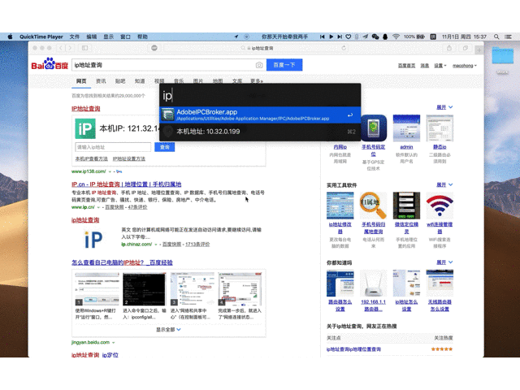
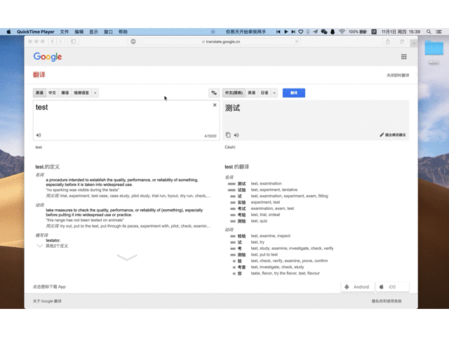

## alfred-plugins

   
 

macOS Alfred2/Alfred3插件 

## 功能
* IP地址转地区，本机IP地址查询
* Google翻译，支持中文--英文，英文--中文

## Demo演示
* IP地址转地区

* Google翻译(中英互译)

## 软件版本
* 软件 python 2.7
* 支持的版本 Alfred2/Alfred3

## 安装方法
* 1、双击dist目录下.alfredworkflow后缀文件即可完成安装
* 2、把dist目录下.alfredworkflow后缀文件拖到Alfred的Workflows选项卡中即可完成安装

## 问题反馈
在使用中有任何问题，欢迎反馈给我，可以用以下联系方式跟我交流

* 邮件(macohong@hotmail.com)

## 感激
感谢以下的项目,排名不分先后

* [ip2region](https://github.com/lionsoul2014/ip2region)
* [execjs](https://github.com/doloopwhile/PyExecJS)
* [workflow](https://github.com/deanishe/alfred-workflow)

## 关于作者
   Maco
